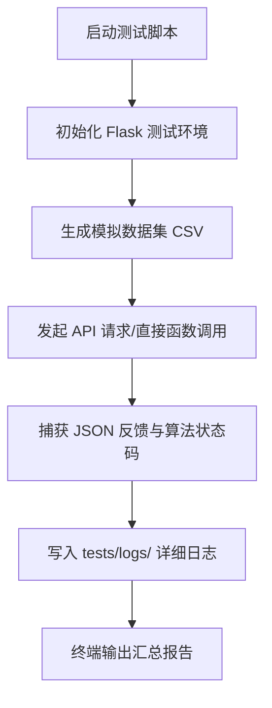

# DataAnalyzer Pro - 测试套件运行指南

本指南旨在说明 `tests/` 目录下四个专项测试脚本的设计逻辑、运行流程及日志解读方法。这些脚本共同构成了系统的**核心算法验证层**。

---

## 1. 整体运行流程图

---

## 2. 脚本详解

### 2.1 清洗算法验证 (`test_algo_cleaning.py`)
*   **设计意图**：验证系统是否能“识别数据形态”并自动选择最佳去噪算法。
*   **主要步骤**：
    1.  构造极端偏态数据（指数分布）。
    2.  构造小样本数据（N < 30）。
    3.  观察系统是否在 `Dixon`、`3σ` 和 `IQR` 之间准确切换。
*   **日志位置**：`tests/logs/test_cleaning.log`

### 2.2 机器学习置信度验证 (`test_algo_ml.py`)
*   **设计意图**：验证预测模型的“自我怀疑”机制（置信度惩罚）。
*   **主要步骤**：
    1.  运行高相关性拟合测试。
    2.  运行完全随机噪声拟合测试。
    3.  验证当 $R^2$ 或相关系数过低时，系统是否触发“退化熔断”，强行将置信度降至 45% 以下。
*   **日志位置**：`tests/logs/test_ml.log`

### 2.3 推断检验验证 (`test_algo_ttest.py`)
*   **设计意图**：验证统计检验的“合规性检查”。
*   **主要步骤**：
    1.  使用 Shapiro-Wilk 算法探测正态性。
    2.  若探测到非正态（本脚本通过构造偏态数据强制触发），验证系统是否自动启用 **Bootstrap 重抽样**。
*   **日志位置**：`tests/logs/test_ttest.log`

### 2.4 编辑沙盒验证 (`test_sys_editor.py`)
*   **设计意图**：验证数据治理流程的自动化。
*   **主要步骤**：
    1.  **隐私探针**：向系统输入包含“身份证”、“姓名”的表单。
    2.  **自动脱敏**：检查系统是否通过关键词匹配自动遮蔽了敏感信息。
    3.  **标准化**：验证 Z-Score 映射逻辑。
*   **日志位置**：`tests/logs/test_editor.log`

---

## 3. 如何阅读日志 (Logs)？

每个日志文件均包含以下结构：
*   `[STEP 1]`: 环境初始化。
*   `[DATA GEN]`: 生成的原始数据特征。
*   `[API REQUEST]`: 发送给后端的 JSON 负载。
*   `[RESULT]`: 后端返回的真实响应（Raw Response）。
*   `[VERDICT]`: 脚本对结果的判定（SUCCESS/FAIL）。

---

## 4. 常见问题 (FAQ)

**Q: 为什么有时候 P-Value 结果不一样？**
A: 因为测试数据是随机生成的。此外，Bootstrap 算法本身具有随机性，但在大样本下其显著性判定（Significant True/False）通常是稳定的。

**Q: 脚本运行报错 ModuleNotFoundError？**
A: 请确保你在项目根目录运行脚本，例如：`python tests/test_algo_ml.py`。
